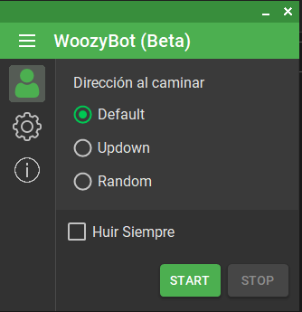
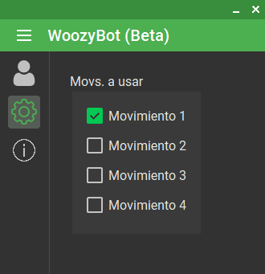

# WoozyBot_PokeOne

Dependencias:

- Instalar Autoit v3 x86 y en el proyecto añadir la referencia.
- MaterialSkins

Este programa se ha creado con fines educativos. 
En ningún caso se recomienda utilizar, no me hago responsable de posibles baneos/bloqueos de cuentas.